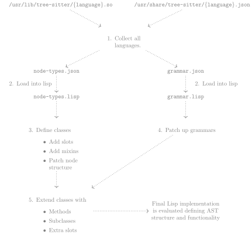
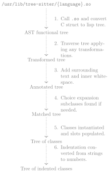

SEL provides abstract syntax trees (ASTs) which can be used for source
code transformation and (light) static analysis.  The ASTs contain all
original source information so they are technically concrete syntax
trees (CSTs) not ASTs although we will refer to them as ASTs
throughout.  Rather than abstracting the information in the ASTs, SEL
provides generic functions which enable the generic treatment of CSTs.

SEL's ASTs are built up as an applicative, immutable, functional tree
data structure.[^functional-trees] This structure provides cheap --
O(1) in time and space -- copy and undo of trees, tree modification in
O(ln(n)) , and emerging support for static analysis via incrementally
calculated attribute grammars.

This document details SEL's use of tree-sitter to build its AST
representation.


# Tree-sitter in the context of SEL

From <https://tree-sitter.github.io/tree-sitter/>:

> Tree-sitter is a parser generator tool and an incremental parsing
> library. It can build a concrete syntax tree for a source file and
> efficiently update the syntax tree as the source file is edited.

SEL's usage:

- Doesn't use the incremental abilities.

- Software transformation and analysis which varies widely from the
  primary upstream use for syntax highlighting.

## Benefits of tree-sitter

- Widespread adoption.  Many people, projects, and organizations
  contribute to tree-sitter resulting in high-quality grammars that
  span many languages and stay up to date as languages evolve.

- Many supported languages.

- Fairly uniform representation across languages.

  Previously, each language in SEL had a different front-end tools
  used to parse ASTs.  These front ends varied widely in their
  requirements (e.g., Clang needed a compilation database) fit to
  SEL's needs and representation.

## What does tree-sitter provide?

-   A shared object with the functionality to read a string and
    generate a CST.  This CST is fairly error-resilient.

-   JSON files which specify the structure of the CST.  Specifically:

    - node-types.json

    - grammar.json (commonly referred to as "the JSON" in discussions)

## Pain Points of tree-sitter

- Tree-sitter has trouble parsing some languages, notably C++.

- Frequently SEL needs to patch the ASTs that come from tree sitter to
  store enough information to reproduce source text.


# SEL Additions

Cross-language Mixins

:   Similar ideas, such as functions, loops, class definitions, etc.,
    can be labeled as such.

    -   This allows for generic function implementations which can be
        used across languages. As an example is the c/cpp mixin which
        allows C and C++ to easily share code. ECMAScript is another
        example allowing multiple JavaScript languages to share their
        implementation.

    -   Mixins are much simpler in lisp and multiple inheritance is much
        simpler to leverage with CLOS.

Source Text Reproduction

:   The source text can be reproduced from the AST.

Modification of Grammar and Node Types

:   The grammar can be patched and node definitions can be modified
    before the generation of lisp code. To support this, there's
    functionality to transform parse trees after they are read into lisp
    such that they match the new grammar and definitions.

    -   For example, there's an issue with newlines having a source
        text range that is larger than one character. This causes
        issues with languages which expect newlines in a
        rule/production. This is commonly a problem with the C
        preprocessor.

Validation of AST Structure

:   If an AST cannot be matched against the grammar, an error will be
    thrown.  This is convenient to flag grammatically invalid
    transformations immediately.  This is particularly useful for
    language agnostic transformations, such as cutting an AST or
    swapping ASTs.

Indentation Maintenance
:   Indentation is stored as the number of spaces. A variable can be set
    to allow for tabs and how many spaces a tab uses. This allows for
    the two most common identation styles--spaces and tabs + spaces. On
    top of this, insertion of new ASTs will maintain the correct amount
    of indentation. This functionality was developed to better support
    Python software.

# Structured Text

## Interleaved Text (Previous Representation)

-   ASTs are interleaved with strings in a list.

-   Eventually evolved into "named childlren"
    -   This assigned children their own named slot/field/member variable

-   This became very cumbersome to use and maintain the strings. As an
    example, removing or adding the 'else' clause of an 'if'
    statement required checking the interleaved text and patching it if
    necessary.

## Structured Text (Current Representation)

Assigns every child a relevant slot in the AST's class definition.
This allows for implicit text between children when printing ASTs back
to source and allows automation of much of the toil of AST
transformation.

### Implicit Text

A large portion of text can be inferred based on the class of an AST.
This is determined by its relevant rule/production in the grammar
file.  As an example, if you have a parenthesized expression AST then
the parenthesis aren't stored anywhere in an instance of that object.
Instead, this information is put into an output-transformation method
which transforms an AST into its relevant string representation, i.e.,
source text.

### Before/After slots

The before and after text slots store whitespace, comments, and any
other information that is, more or less, ignored by the grammar.

- This information is pushed down from the parent into the closest
  child AST.

- If the relevant information is surround by child ASTs, the relevant
  before slot is preferred over the after.  (This is by convention and
  heuristic as opposed to any technical reason.)

In practice the above two rules often results in the *expected*
result.  E.g., both functions at the top level and statements within a
function are often preceded by explanatory comments.  The above
assures that these comments move with the code to which they apply.

### Internal AST slots

There are places where whitespace and comments occur which do not have
any surrounding children. Instead of pushing it to children, it is
instead stored in internal AST slots. Adding these slots to nodes is
part of the code generation process.

### Computed Text (Variable Part)

Variable text, such as function names and variable names, need to be
computed and stored at AST creation. These can, however, have children
of their own, so they can't always be stored as only text.

-   Text Fragments are used to separate the children ASTs from the
    variable part. This maintains a list of ASTs instead of regressing
    back to the interleaved text representation.

### Source Text Fragments

In some cases the the grammar can't be matched exactly. This may occur
when a file is actively being edited. The resulting AST can no longer be
matched when validating the parent AST's rule. The parent is instead
turned into a source text fragment AST which still allows for source
text reproduction.

-   tree-sitter either adds a zero-width token to force a matching
    rule/production or removes tokens from consideration until something
    does match.

-   Note that tree-sitter frequently gets the parent AST's type
    incorrect when an error occurs, so source-text fragments protects
    against incorrect information.

### Choice Expansion Subclasses

Each choice/alternation in the rule/production for node or AST is
expanded to create a new subclass for each branch that could be taken.
This is done for every choice branch which is not in a
repeat/repetition.

-   We can only match/validate on information that is stored in the
    AST/node object. By creating these different subclasses, information
    is stored implicitly based on the subclass. This allows semantically
    identical ASTs to have different implicit source text.

-   Of note, when a subclass can no longer match on the values stored
    in its slots, it will go through every possible sibling subclass
    until it can match on one. This is done by literally changing the
    class of the object. This is particularly useful when mutating
    classes like `if` statements because removal or addition of the
    `else` clause no longer requires any analysis to determine if the
    source text is still valid.

##### Choice Expansion Example

The update expression in C++ has two forms--prefix and postfix--but both use
the same set of fields. This becomes a problem when trying to match the slots
during source text reproduction as its ambiguous which 'CHOICE' branch should be
taken. To address this, each 'CHOICE' branch in the relevant production is
expanded into its own subclass with its own production. For example, the
production for update expressions in C++ is the following:

```lisp
(:UPDATE-EXPRESSION
 (:TYPE . "PREC_RIGHT") (:VALUE . 13)
 (:CONTENT
  (:TYPE . "CHOICE")
  (:MEMBERS
   ((:TYPE . "SEQ")
    (:MEMBERS
     ((:TYPE . "FIELD") (:NAME . "operator")
      (:CONTENT
       (:TYPE . "CHOICE")
       (:MEMBERS ((:TYPE . "STRING") (:VALUE . "--"))
                 ((:TYPE . "STRING") (:VALUE . "++")))))
     ((:TYPE . "FIELD") (:NAME . "argument")
      (:CONTENT (:TYPE . "SYMBOL") (:NAME . "_expression")))))
   ((:TYPE . "SEQ")
    (:MEMBERS
     ((:TYPE . "FIELD") (:NAME . "argument")
      (:CONTENT (:TYPE . "SYMBOL") (:NAME . "_expression")))
     ((:TYPE . "FIELD") (:NAME . "operator")
      (:CONTENT
       (:TYPE . "CHOICE")
       (:MEMBERS ((:TYPE . "STRING") (:VALUE . "--"))
                 ((:TYPE . "STRING") (:VALUE . "++"))))))))))
```

It is separated into the following subclasses:

```lisp
;;; prefix
(:UPDATE-EXPRESSION-0
 (:TYPE . "PREC_RIGHT") (:VALUE . 13)
 (:CONTENT
  (:TYPE . "CHOICE")
  (:MEMBERS
   ((:TYPE . "SEQ")
    (:MEMBERS
     ((:TYPE . "FIELD") (:NAME . "operator")
      (:CONTENT
       (:TYPE . "CHOICE")
       (:MEMBERS ((:TYPE . "STRING") (:VALUE . "--"))
                 ((:TYPE . "STRING") (:VALUE . "++")))))
     ((:TYPE . "FIELD") (:NAME . "argument")
      (:CONTENT (:TYPE . "SYMBOL") (:NAME . "_expression"))))))))

;;; postfix
(:UPDATE-EXPRESSION-1
 (:TYPE . "PREC_RIGHT") (:VALUE . 13)
 (:CONTENT
  (:TYPE . "CHOICE")
  (:MEMBERS
   ((:TYPE . "SEQ")
    (:MEMBERS
     ((:TYPE . "FIELD") (:NAME . "argument")
      (:CONTENT (:TYPE . "SYMBOL") (:NAME . "_expression")))
     ((:TYPE . "FIELD") (:NAME . "operator")
      (:CONTENT
       (:TYPE . "CHOICE")
       (:MEMBERS ((:TYPE . "STRING") (:VALUE . "--"))
                 ((:TYPE . "STRING") (:VALUE . "++"))))))))))
```

The base update expression class becomes a superclass, and when the parse tree
is transformed into an SEL representation, each subclass's production is tested
until one matches.

### Parse Tree Transforms
Frequently, the productions used in SEL for a language differ from the upstream
tree-sitter ones. When this happens, the parse tree needs to be transformed to
match what the SEL production expects. To do this, a specialization of
transform-parse-tree is written. It takes a parse tree and modifies it to fit
the expected SEL representation. The following is an example transformation:

```lisp
(defun modify-async-parse-tree (parse-tree)
  "Transform PARSE-TREE such that an async field is present for 'async'
identifiers."
  (with-modify-parse-tree (parse-tree)
    (:async (label-as :async))))

(defmethod transform-parse-tree
    ((language (eql ':python)) (class (eql 'python-function-definition))
     parse-tree &key)
  (modify-async-parse-tree parse-tree))
```

This takes a parse tree and labels any :async node such that it is stored in the
:async field. The following shows an example transformation performed by this
method:

```lisp
;;; Parse Tree "def fun():\n  pass"
(:FUNCTION-DEFINITION ((0 0) (6 1))
 ((:ASYNC ((0 0) (5 0)) NIL) (:DEF ((6 0) (9 0)) NIL)
  ((:NAME :IDENTIFIER) ((10 0) (13 0)) NIL)
  ((:PARAMETERS :PARAMETERS) ((13 0) (15 0))
   ((:|(| ((13 0) (14 0)) NIL) (:|)| ((14 0) (15 0)) NIL)))
  (:|:| ((15 0) (16 0)) NIL)
  ((:BODY :BLOCK) ((2 1) (6 1))
   ((:PASS-STATEMENT ((2 1) (6 1)) ((:PASS ((2 1) (6 1)) NIL)))))))

;;; Transformed Parse Tree
(:FUNCTION-DEFINITION ((0 0) (6 1))
 (((:ASYNC :ASYNC) ((0 0) (5 0)) NIL) (:DEF ((6 0) (9 0)) NIL)
  ((:NAME :IDENTIFIER) ((10 0) (13 0)) NIL)
  ((:PARAMETERS :PARAMETERS) ((13 0) (15 0))
   ((:|(| ((13 0) (14 0)) NIL) (:|)| ((14 0) (15 0)) NIL)))
  (:|:| ((15 0) (16 0)) NIL)
  ((:BODY :BLOCK) ((2 1) (6 1))
   ((:PASS-STATEMENT ((2 1) (6 1)) ((:PASS ((2 1) (6 1)) NIL)))))))
```

# Code Generation

Much of the code building SEL's ASTs from tree-sitter's parser and
grammars is dynamically generated at build time.  SEL code parses
tree-sitter's grammars and then automatically builds the relevant SEL
classes and methods to support the above functionality.  This allows
SEL to *consistently* and *efficiently* track the latest tree-sitter
grammars.

The actual code used to drive this is only about 2-3 KLoC.  It
generates hundreds of KLoC of code.

<center>

| Language   | Generated LoC |
|------------|---------------|
| C          | ~18K          |
| Python     | ~20K          |
| JavaScript | ~20K          |
| Rust       | ~35K          |
| C++        | ~50K          |
| TypeScript | ~110K         |

</center>

The code generation process is shown below.

<center>

<!-- !include code-generation.md -->


</center>

The code generation sequence is as follows:

1. Identifies every tree-sitter module available for the system.
2. Both the node-types and grammar JSON files are read in
3. The initial classes are created based on the node-types file and
   stored in a hash table so that they can be modified during code
   generation
   1.  Additional slots, superclasses, and patches to node structures
       are added as specified by several special variables defined at
       the top-level.
4. The grammar JSON is extensively patched.
   1.  The rule/production is traversed looking for places where two
       unnamed/unnamed/terminal symbols occur back-to-back without
       either of them being assigned to a slot. Internal-ast slots are
       assigned in between these such that the whitespace and/or
       comments can be stored and reproduced.
   2.  All aliases have their rule/production added to the node types
       it aliases to by wrapping the rule in a choice/alternation and
       adding a new branch with it. This solved several reoccuring
       problems.
   3.  Several different versions of the rule are generated. Each
       serves a different purpose: unchanged json rule, pruned rule,
       and collapsed rule. The pruned rule removed any subtree which
       doesn't contain information stored that is to be stored on an
       object and replaces that subtree with nil. This is used
       extensively for matching parse trees and ASTs. The collapsed
       rule collapses nested choices and sequences on themselves, and
       further removes any nil's from the tree. It is only used for
       detecting problematic rules.
   4.  Problematic rules are identified and printed out at compile time.
       These are the rules where the correct reproduction of source text
       could be ambiguous due to lack of stored information.
5. Add functionality to classes
   1. Choice expansion subclasses are generated
   2. Rules, choice expansion subclass information are attached to slots
      with class allocation.
   3. Several methods are generated.
      1.  An output transformation which transfroms an AST into
          source-text. This inserts any implicit text.
      2.  A method to determine which subclass is used by a parse tree.

## Code Generation Examples

### AST Class

```lisp
(define-node-class cpp-attribute-specifier (cpp-ast)
  ((json-rule :initform
              '((:type . "SEQ")
                (:members
                 ((:type . "STRING")
                  (:value . "__attribute__"))
                 ((:type . "SLOT")
                  (:name . "INTERNAL-ASTS-0"))
                 ((:type . "STRING") (:value . "("))
                 ((:type . "SYMBOL")
                  (:name . "argument_list"))
                 ((:type . "STRING") (:value . ")"))))
              :reader json-rule :allocation :class
              :documentation
              "A rule used to determine where inner ASTs are assigned.")
   (pruned-rule :accessor pruned-rule :initform
                '(:seq nil (:slot cpp-internal-asts-0)
                  nil (:child cpp-argument-list) nil)
                :allocation :class :documentation
                "A rule used to order the children of this class.")
   (slot-usage :accessor slot-usage :initform
               '(children cpp-internal-asts-0)
               :allocation :class :documentation
               "A set of slots that are used in the pruned-rule.")
   (cpp-internal-asts-0 :accessor cpp-internal-asts-0
                        :initarg :cpp-internal-asts-0
                        :initform nil)
   (child-slots :initform
                '((before-asts . 0) (children . 0)
                  (cpp-internal-asts-0 . 0)
                  (after-asts . 0))
                :allocation :class))
  (:documentation "Generated for attribute_specifier.")
  (:method-options :skip-children-definition))
```

### Output Transformation

```lisp
(defmethod output-transformation
    ((ast cpp-attribute-specifier) &rest rest &key
     &aux (parse-stack (parse-order ast)))
  (declare (ignorable parse-stack rest))
  (flatten
   (list (before-text ast)
         (list "__attribute__" (pop parse-stack) "(" (pop parse-stack)
               ")")
         (after-text ast))))
```
# AST creation

The actual process of parsing source text and creating SEL ASTs is
shown in the following diagram.

<center>

<!-- !include ast-creation.md -->


</center>

The sequence of steps is as follows:

1.  cl-tree-sitter calls tree-sitter SO and converts the C structure
    into a tree.
2.  transform-parse-tree traverses the tree and runs
    transform-parse-tree methods on any subtree which has a
    transformation defined. This allows for bugs and extra features to
    be patched by SEL.
3.  The transformed parse tree has surrounding text annotations added to
    it and inner whitespace subtrees are created for any whitespace that
    can't be attached to a child AST.
4.  The parse tree is passed to match-parsed-children and a valid choice
    expansion subclass is found if needed. Otherwise, it simply checks
    if the class matches if there aren't any subclasses. If it fails to
    match, an error occurs.
5.  At this point the parse tree is rebuilt as an applicative tree
    using functional-trees.[^functional-trees] An instance of the
    relevant class is instantiated and its slots are populated with
    its named children, internal ASTs, and surrounding text.
6.  The AST has its indentation converted from a string into a number.

[^functional-trees]: https://github.com/grammatech/functional-trees

## Example of Populated AST
The following will show the structure of an AST that is converted from the
following C source text:

```c
for /* comment */ (int i;;   ) {
  if (++i) {
    break;
}
```

It contains a comment between two terminal tokens, whitespace after a terminal
token, and a missing curly bracket. The following Lisp Repl interaction will show
how and where these are stored in the following tree:

```lisp
SEL/SW/TS> (convert 'cpp-ast "for /* comment */ (int i;;   ) {
  if (++i) {
    break;
}")
#<CPP-TRANSLATION-UNIT 3135 :TEXT "for /* comment */ (i...">
SEL/SW/TS> (def ast (find-if (of-type 'cpp-for-statement) *))
AST
;;; The body is converted into a source text fragment due to the missing '}' and
;;; is stored in the cpp-body slot.
SEL/SW/TS> (cpp-body ast)
#<CPP-SOURCE-TEXT-FRAGMENT 3142 :TEXT "{">
SEL/SW/TS> (text *)
"{
  if (++i) {
    break;
}"
;;; The comment following the 'for' and preceding the '(' is stored in an
;;; internal-asts slot.
SEL/SW/TS> (cpp-internal-asts-0 ast)
(#<CPP-COMMENT 3137 :TEXT "/* comment */">)
;;; The comment following the 'for' and preceding the '(' is stored in an
;;; internal-asts slot.
SEL/SW/TS> (cpp-internal-asts-3 ast)
(#<CPP-INNER-WHITESPACE 3141 :TEXT "   ">)
;;; The initializer successfully parsed and is stored in the cpp-initializer
;;; slot.
SEL/SW/TS> (cpp-initializer ast)
#<CPP-DECLARATION-0 3138 :TEXT "int i;">
```
